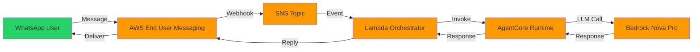
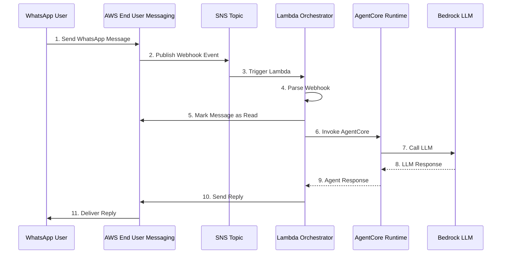
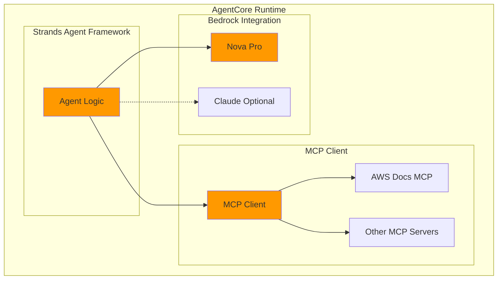
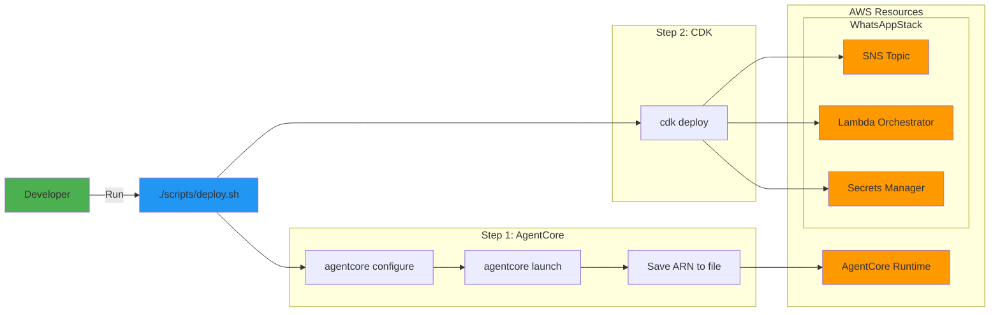
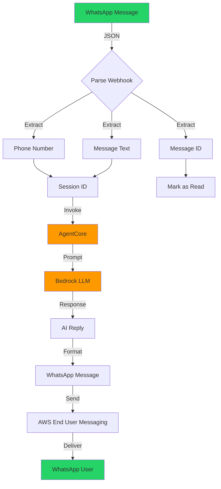

# Architecture Diagrams (Mermaid)

Diagrams in Mermaid format for easy rendering in GitHub/GitLab.

## 1. System Overview



## 2. WhatsApp Message Flow



## 3. AgentCore Runtime Architecture



## 4. Deployment Pipeline



## 5. Data Flow



---

## Rendering

These diagrams render automatically on:

- GitHub
- GitLab
- VS Code (with Mermaid extension)
- Documentation sites (MkDocs, Docusaurus, etc.)

## Exporting to PNG

### Option 1: Mermaid CLI

```bash
npm install -g @mermaid-js/mermaid-cli
mmdc -i diagrams.md -o system-overview.png
```

### Option 2: Online

Visit: https://mermaid.live/

### Option 3: VS Code

1. Install "Markdown Preview Mermaid Support" extension
2. Open this file
3. Right-click diagram → Export to PNG

---

**Last Updated**: 2025-10-08
