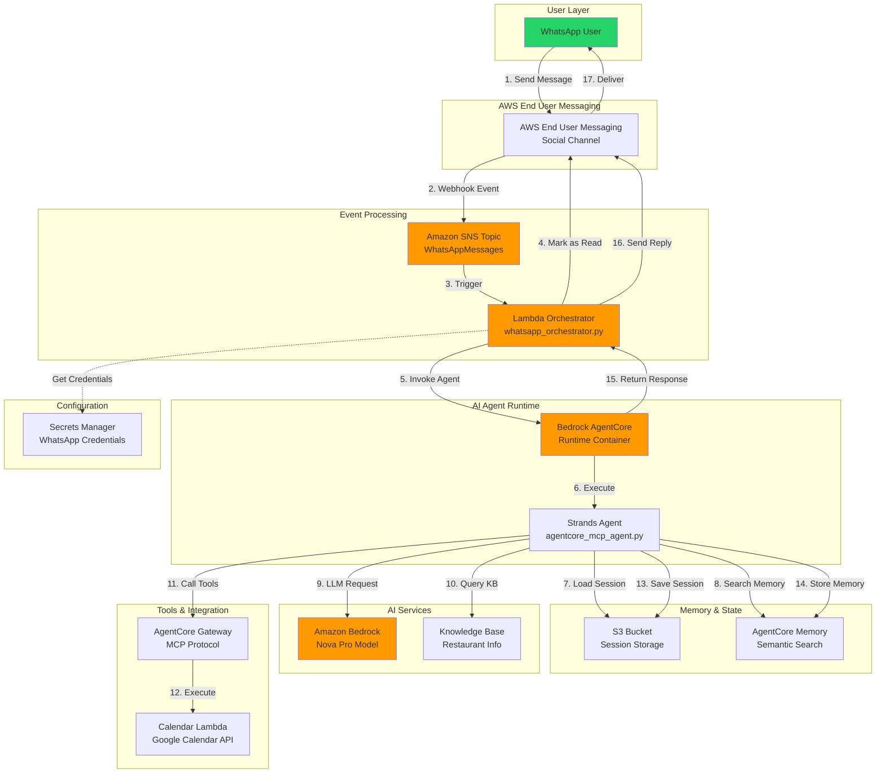
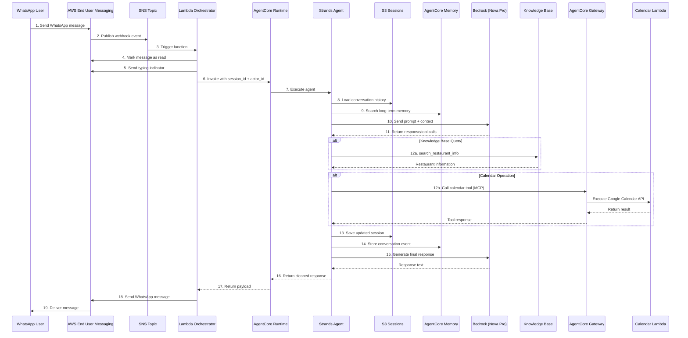
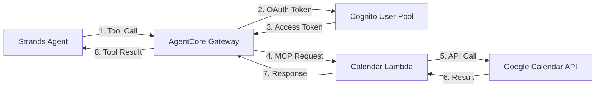
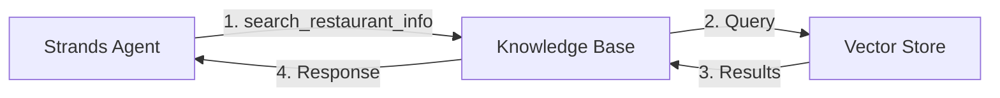

# System Architecture

## Overview

Multi-path booking assistant using AWS Bedrock AgentCore and Strands Agents framework:

1. **WhatsApp Path**: Full-featured agent with memory for end-user conversations
2. **A2A Path**: Lightweight agent for orchestrator integration (Claude Desktop)

Both paths use AgentCore Gateway for Google Calendar integration.

**🔴 AP2 Payment Protocol**: AP2 (Agent Payment Protocol) with x402 stablecoin payments is designed for **A2A path only**, not WhatsApp path. This demonstrates proper agent-to-agent payment protocol usage. **Payments require explicit human approval via Claude Desktop MCP tool** (human-in-the-loop). See `ADR-004-AP2-Payment-A2A-Only.md` for full architectural decision.

## High-Level Architecture



## Component Details

### 1. WhatsApp Integration

**AWS End User Messaging (Social)**:

- Manages WhatsApp Business API connection
- Receives incoming messages from users
- Sends outgoing messages to users
- Handles message status (read receipts, typing indicators)
- No API Gateway - direct SNS integration

### 2. Event Processing Layer

**Amazon SNS Topic** (`WhatsAppMessages`):

- Receives webhook events from AWS End User Messaging
- Decouples message reception from processing
- Triggers Lambda orchestrator asynchronously

**Lambda Orchestrator** (`whatsapp_orchestrator.py`):

- Runtime: Python 3.12
- Processes WhatsApp webhook events
- Marks messages as read (blue checkmarks)
- Sends typing indicators
- Invokes AgentCore runtime with session context
- Sends responses back via AWS End User Messaging
- X-Ray tracing enabled

### 3. AI Agent Runtime

**Bedrock AgentCore Runtime**:

- Deployed via `bedrock-agentcore-starter-toolkit`
- Runs Strands agent in managed container (ECR)
- Handles agent lifecycle and scaling
- Provides MCP protocol support for tools
- Automatic memory integration

**Strands Agent** (`agentcore_mcp_agent.py`):

- Framework: Strands Agents (AWS)
- Model: Amazon Nova Pro (`us.amazon.nova-pro-v1:0`)
- Conversation Manager: Sliding window (100 turns)
- Session Manager: S3-based persistence
- Memory Hooks: Short-term + long-term
- Response cleaning: Removes `<think>` tags

### 4. Memory & State Management

**S3 Session Storage** (`agentcore-sessions-{account}`):

- Stores conversation history per actor
- Session ID format: `whatsapp-{phone}-{date}-{hash}`
- Daily session rotation
- Loaded by S3SessionManager

**AgentCore Memory**:

- Semantic search across all sessions
- Actor-isolated memory stores
- Automatic indexing of conversations
- Long-term context retrieval

### 5. AI Services

**Amazon Bedrock**:

- Model: Nova Pro (reasoning + generation)
- Handles natural language understanding
- Generates conversational responses
- Supports tool calling

**Bedrock Knowledge Base**:

- Restaurant information (menu, hours, policies)
- Allergen information
- FAQ responses
- Queried via `search_restaurant_info` tool

### 6. Tools & Integration

**AgentCore Gateway** (MCP Protocol):

- Exposes external APIs as agent tools
- OAuth authentication via Cognito
- Configured via `gateway_config.json`
- Loaded dynamically at agent startup

**Calendar Lambda** (`handler.py`):

- Google Calendar API integration
- Tools: createEvent, listEvents, deleteEvent, checkAvailability, getAvailableSlots
- Service account authentication
- Conflict detection and validation

**Built-in Tools**:

- `current_time`: Date/time utility
- `search_restaurant_info`: Knowledge Base queries

### 7. Configuration & Secrets

**AWS Secrets Manager**:

- Secret: `whatsapp-booking/credentials`
- Contains WhatsApp phone number ID and credentials
- Accessed by Lambda orchestrator

**Environment Variables** (AgentCore Dockerfile):

- `GOOGLE_CALENDAR_ID`: Target calendar
- `SESSION_BUCKET`: S3 bucket name
- `BEDROCK_MODEL_ID`: LLM model
- `AWS_REGION`: Deployment region

### 8. Infrastructure as Code

**AWS CDK** (`cdk_infra/`):

- Stacks: WhatsAppStack, CalendarServiceStack, RestaurantKBStack
- Resources: Lambda, SNS, S3, Secrets Manager, IAM roles
- Language: Python
- Deployment: `cdk deploy --all`

**AgentCore Deployment** (Toolkit):

- Command: `agentcore launch`
- Builds Docker container
- Pushes to ECR
- Deploys to Bedrock AgentCore
- Returns runtime ARN

## Data Flow

### Incoming Message Flow



### Message Processing Steps

**1-3. Message Reception**:

- User sends message via WhatsApp
- AWS End User Messaging receives and validates
- Webhook event published to SNS topic
- SNS triggers Lambda orchestrator

**4-5. User Experience**:

- Lambda marks message as read (blue checkmarks)
- Lambda sends typing indicator (shows "typing...")

**6-7. Agent Invocation**:

- Lambda generates session ID: `whatsapp-{phone}-{date}-{hash}`
- Lambda extracts actor ID from phone number
- Lambda invokes AgentCore with payload:
  ```json
  {
    "prompt": "user message",
    "session_id": "whatsapp-1234567890-20250110-abc123",
    "actor_id": "+1234567890"
  }
  ```
- AgentCore starts agent execution

**8-9. Context Loading**:

- Agent loads last 100 conversation turns from S3
- Agent searches long-term memory for relevant past interactions
- Context combined with system prompt

**10-11. LLM Processing**:

- Agent sends prompt + context to Bedrock Nova Pro
- Model generates response or requests tool calls
- Response cleaned (removes `<think>` tags)

**12. Tool Execution** (if needed):

- **Knowledge Base**: Direct boto3 call to `bedrock-agent-runtime`
- **Calendar Tools**: Via AgentCore Gateway (MCP protocol)
  - Gateway authenticates with OAuth token
  - Calls Calendar Lambda
  - Returns structured result

**13-14. State Persistence**:

- Updated conversation saved to S3
- Memory event stored in AgentCore Memory
- Actor-isolated storage

**15-19. Response Delivery**:

- Final response generated by LLM
- Returned through AgentCore → Lambda
- Lambda sends via AWS End User Messaging
- Message delivered to user's WhatsApp

### Memory Flow

**Short-term Memory** (Conversation History):

```
S3: agentcore-sessions-{account}/
  └── whatsapp-1234567890-20250110-abc123.json
      ├── messages: [last 100 turns]
      ├── metadata: {actor_id, timestamp}
      └── context: {session_state}
```

**Long-term Memory** (Semantic Search):

```
AgentCore Memory Store (per actor):
  ├── Indexed conversation events
  ├── Semantic embeddings
  ├── Searchable across all sessions
  └── Actor-isolated access
```

**Memory Lifecycle**:

1. **Load**: Agent retrieves session from S3 + searches memory
2. **Process**: LLM uses combined context
3. **Save**: Updated session written to S3
4. **Index**: New events stored in memory for future retrieval

### Tool Invocation Flow

**Gateway Tools** (Calendar):



**Direct Tools** (Knowledge Base):



## Key Features

### Memory Architecture

**Short-term Memory** (Sliding Window):

- Last 100 conversation turns per session
- Stored in S3 as JSON
- Loaded on every agent invocation
- Daily session rotation

**Long-term Memory** (Semantic Search):

- All conversations indexed in AgentCore Memory
- Searchable across sessions
- Actor-isolated (per phone number)
- Automatic embedding generation

**Actor Isolation**:

- Each user has separate memory store
- Phone number used as actor ID
- No cross-user data leakage

**Session Management**:

- Session ID: `whatsapp-{phone}-{date}-{hash}`
- Daily rotation for fresh context
- Persistent across same-day conversations

### Calendar Integration

**Available Tools** (via Gateway):

- `createEvent`: Create new booking
- `listEvents`: View existing bookings
- `deleteEvent`: Cancel booking
- `checkAvailability`: Check time slot
- `getAvailableSlots`: Get free times

**Features**:

- Conflict detection (prevents double bookings)
- Business hours validation
- Smart time suggestions
- Google Calendar sync

### WhatsApp UX Enhancements

**Read Receipts**:

- Blue checkmarks when message received
- Implemented via `mark_message_as_read()`

**Typing Indicators**:

- Shows "typing..." while processing
- Sent before AgentCore invocation
- Improves perceived responsiveness

**Response Cleaning**:

- Removes `<think>` and `<thinking>` tags
- Strips internal reasoning from output
- Clean, natural responses

**Simple Confirmations**:

- No calendar links (not useful on WhatsApp)
- Text-only confirmations
- Phone number already known from WhatsApp context

## Security

### Authentication & Authorization

**IAM Roles**:

- Lambda execution role with least privilege
- AgentCore runtime role for Bedrock/S3 access
- Calendar Lambda role for Google API

**Secrets Management**:

- WhatsApp credentials in Secrets Manager
- Google service account key in Secrets Manager
- No hardcoded credentials

**Actor Isolation**:

- Memory stores separated by phone number
- S3 sessions prefixed with actor ID
- No cross-user access

### Data Protection

**Encryption**:

- At rest: S3 (SSE), Secrets Manager (KMS)
- In transit: HTTPS/TLS for all API calls

**Data Retention**:

- Sessions: Stored indefinitely (can be configured)
- Memory: Persistent across deployments
- Logs: CloudWatch retention policies

**PII Handling**:

- Phone numbers used as identifiers
- No PII logged in CloudWatch
- Customer names stored in session context only

## Scalability

### Auto-Scaling Components

**Lambda Orchestrator**:

- Concurrent executions: Up to 1000 (default)
- Auto-scales with incoming messages
- Cold start: ~1-2 seconds

**AgentCore Runtime**:

- Managed scaling by AWS
- Container-based execution
- Automatic load balancing

**SNS Topic**:

- Unlimited throughput
- Asynchronous processing
- Message buffering

### Performance Characteristics

**Response Time**:

- Simple queries: 2-4 seconds
- With tool calls: 4-8 seconds
- Calendar operations: +1-2 seconds

**Throughput**:

- Messages/second: Limited by Lambda concurrency
- Concurrent users: Unlimited (serverless)

**Memory Usage**:

- Lambda: 512 MB (configurable)
- AgentCore: Managed by AWS

## Deployment

### Infrastructure Deployment

**AgentCore** (via toolkit):

```bash
# Configure agent
uv run agentcore configure \
    --entrypoint src/agents/agentcore_mcp_agent.py \
    --requirements-file src/agents/requirements.txt \
    --region us-east-1 \
    --non-interactive

# Deploy to Bedrock
uv run agentcore launch
```

**CDK Stacks**:

```bash
cd cdk_infra
uv run cdk deploy --all --require-approval never
```

**Deployment Flow**:

```mermaid
graph LR
    Code[Agent Code] -->|1. Configure| Config[agentcore configure]
    Config -->|2. Build| Docker[Docker Container]
    Docker -->|3. Push| ECR[Amazon ECR]
    ECR -->|4. Deploy| AgentCore[Bedrock AgentCore]
    AgentCore -->|5. Return| ARN[Runtime ARN]
    ARN -->|6. Use in| CDK[CDK Deployment]
    CDK -->|7. Deploy| Lambda[Lambda + SNS]
```



### Deployment Automation

**Single Command** (`./scripts/deploy.sh`):

1. Deploy AgentCore runtime
2. Save runtime ARN to file
3. Deploy CDK stacks
4. Reset sessions and memory
5. Verify deployment

**Session Reset** (automatic):

- Clears S3 session storage
- Resets AgentCore memory
- Ensures fresh start after code changes

## Monitoring & Observability

### CloudWatch Logs

**Lambda Logs**:

- Log group: `/aws/lambda/WhatsAppStack-WhatsAppOrchestrator*`
- Contains: Message processing, errors, X-Ray traces

**AgentCore Logs**:

- Log group: `/aws/bedrock-agentcore/runtimes/*`
- Contains: Agent execution, tool calls, LLM responses

### X-Ray Tracing

**Traced Operations**:

- Lambda invocations
- AgentCore calls
- Bedrock API requests
- S3 operations

**Trace Segments**:

- `mark_message_as_read`
- `send_typing_indicator`
- `invoke_agentcore`
- `send_whatsapp_reply`

### Metrics

**Lambda Metrics**:

- Invocations
- Duration
- Errors
- Concurrent executions

**AgentCore Metrics**:

- Runtime invocations
- Tool execution count
- Memory operations

## Cost Optimization

### Cost Factors

**Primary Costs**:

- Bedrock model inference (per token)
- Lambda invocations + duration
- AgentCore runtime hours
- S3 storage (sessions)
- Knowledge Base queries

**Secondary Costs**:

- SNS message delivery
- CloudWatch logs storage
- X-Ray traces
- Data transfer

### Optimization Strategies

**Model Usage**:

- Use Nova Pro (cost-effective reasoning)
- Clean prompts to reduce tokens
- Cache common responses

**Lambda**:

- Right-size memory allocation
- Minimize cold starts
- Batch operations where possible

**Storage**:

- Implement session expiration
- Compress session data
- Use S3 lifecycle policies

**Monitoring**:

- Set CloudWatch log retention
- Sample X-Ray traces
- Archive old logs to S3

## Disaster Recovery

### Backup Strategy

**Critical Data**:

- AgentCore runtime ARN (stored in `.agentcore-runtime-arn`)
- Gateway configuration (`gateway_config.json`)
- CDK stack definitions (in Git)
- Session data (S3 with versioning)

**Configuration**:

- Secrets Manager (automatic replication)
- Environment variables (in Dockerfile)
- CDK parameters (in code)

### Recovery Procedures

**AgentCore Failure**:

1. Redeploy: `uv run agentcore launch`
2. Update ARN in CDK
3. Redeploy Lambda: `cdk deploy WhatsAppStack`

**Lambda Failure**:

1. Check CloudWatch logs
2. Rollback to previous version (if using aliases)
3. Or redeploy: `cdk deploy WhatsAppStack`

**Session Data Loss**:

- S3 versioning enabled
- Restore from previous version
- Memory persists independently

**Complete Disaster**:

```bash
# 1. Redeploy AgentCore
uv run agentcore launch

# 2. Redeploy all CDK stacks
cd cdk_infra && uv run cdk deploy --all

# 3. Restore secrets (manual)
# 4. Verify with test message
```

## Future Enhancements

### Planned Features

**Booking Management**:

- Modify existing bookings
- Recurring bookings
- Booking reminders via WhatsApp

**Multi-Agent System**:

- Separate agents for booking, info, payments
- Agent-to-Agent (A2A) communication
- Specialized agent routing

**Payment Integration**:

- AP2 protocol support
- Payment confirmation
- Receipt generation

**Analytics**:

- User interaction metrics
- Booking conversion rates
- Agent performance monitoring
- Cost tracking dashboard

**Multi-Language**:

- Language detection
- Translated responses
- Localized date/time formats

## Technical Specifications

### System Requirements

**AWS Account**:

- Bedrock access in us-east-1
- AgentCore preview access
- Sufficient service quotas

**External Services**:

- WhatsApp Business Account
- Google Calendar API access
- Service account credentials

### Supported Regions

**Current**: us-east-1 only

- AgentCore preview limitation
- All resources must be in same region

### API Versions

- AWS End User Messaging: v19.0
- Bedrock AgentCore: Preview
- Google Calendar API: v3
- MCP Protocol: 1.0.0

## References

### Documentation

- [AWS End User Messaging](https://docs.aws.amazon.com/social-messaging/)
- [Bedrock AgentCore](https://docs.aws.amazon.com/bedrock/latest/userguide/agents.html)
- [Strands Agents](https://github.com/strands-agents/strands-agents)
- [AWS CDK](https://docs.aws.amazon.com/cdk/)
- [MCP Protocol](https://modelcontextprotocol.io/)

### Internal Documentation

- [Memory Architecture](./MEMORY_ARCHITECTURE.md)
- [Calendar Integration](./CALENDAR_INTEGRATION_DECISION.md)
- [Knowledge Base Setup](./KB_MANUAL_SETUP.md)
- [Lambda Versions & Aliases](./LAMBDA_VERSIONS_ALIASES.md)

---

**Last Updated**: 2025-01-10
**Maintainer**: Teamwork Mauritius
**License**: AGPL-3.0
